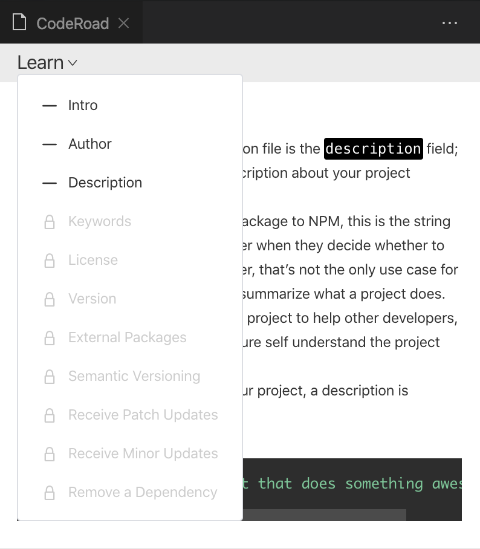
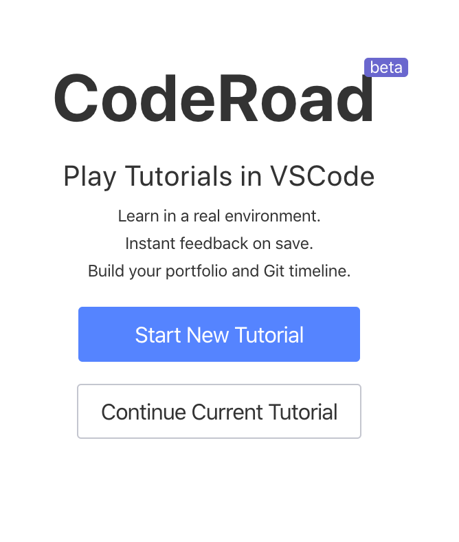
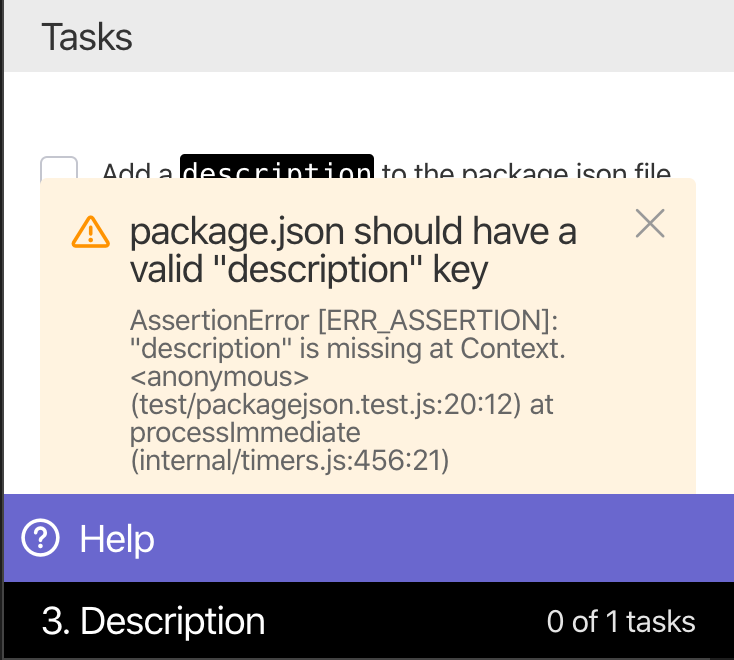

# Change Log

All notable changes to the "coderoad-vscode" extension will be documented in this file.

Check [Keep a Changelog](http://keepachangelog.com/) for recommendations on how to structure this file.

## [0.1.0]

- Initial release

## [0.2.0]

- Improvements to error handling
- Validate Git installed on startup
- Validate Git remote can connect on tutorial selection
- Fix component translation issues

## [0.2.1]

- Improves error page
- Adds tutorial dependency validation in tutorial config. See an example below:

```json
{
  "config": {
    "dependencies": [
      {
        "name": "node", // command line process to run
        "version": "^10", // see node-semver for options
        "message": "An optional message to display if the validation fails"
      },
      {
        "name": "npm",
        "version": ">=5"
      }
    ]
  }
}
```

## [0.2.2]

- Fixes issue where app fails on startup without a workspace, and instead returns an error page

## [0.2.3]

- Support Windows OS

## [0.2.4]

- Support VSCode 1.39.2

## [0.3.0]

- Validate the extension version against the tutorial config version. This should allow us to manage breaking changes in tutorial schema in upcoming versions. See [node-semver](https://github.com/npm/node-semver#advanced-range-syntax) for possible version ranges and options.

```json
{
"config": {
  "appVersions": {
    "vscode": ">=0.2"
  },
}
```

- Configure the CodeRoad to load and run in a different directory. The example below will:
  - load a commit and run npm install to setup the test runner in its own folder.
  - run "npm test" in the \$ROOT/coderoad directory on save

```json
{
"config": {
  "testRunner": {
    "command": "npm test", // runs in path location or root
    "path": "coderoad",
    "actions": {
      "commits": ["a974aea"],
      "commands": ["npm install"] // runs in path location or root
    }
  },
}
```

Resulting in a folder structure like the following:

```
- .vscode
- coderoad (test runner files only with their own setup)
  - package.json
  - tests
- package.json
- server.js
```

## [0.4.0]

- Want to look back at a previous lesson's content? Navigate through text content from previous levels by clicking the "Learn" dropdown.



- Continue an incomplete tutorial started in the same workspace. Choose the "continue" path from the start screen. Progress is stored in local storage in the workspace.



## [0.5.0]

- Show test fail messages in the webview UI



- Display error messages if React fails to load

## [0.6.0]

- New configuration environment variables for web compatability

```
CODEROAD_DISABLE_RUN_ON_SAVE=true // blocks saving on file system changes
CODEROAD_DISPLAY_RUN_TEST_BUTTON=true // adds a run test button to tutorial page
CODEROAD_TUTORIAL_URL='path/to/tutorial_config_file.json' // will load directly into tutorial
```

- Improves styles for inline code blocks

## [0.6.1]

- Replace checkboxes with icons

## [0.7.0]

- Change for the test runner config. Changes are backwards compatible.

1. `testRunner.path`=> `testRunner.directory`
2. `testRunner.actions` => `testRunner.setup`
3. Change command to capture `args` for "TAP" support, and test "filter"ing support. These changes will help lead to specific test suite presets in the future.

```json
{
  "testRunner": {
    "command": "mocha",
    "args": {
      "filter": "--grep",
      "tap": "--reporter=mocha-tap-reporter"
    },
    "directory": ".coderoad",
    "setup": {
      "commits": ["410bd4f"],
      "commands": ["npm install"]
    }
  }
}
```
